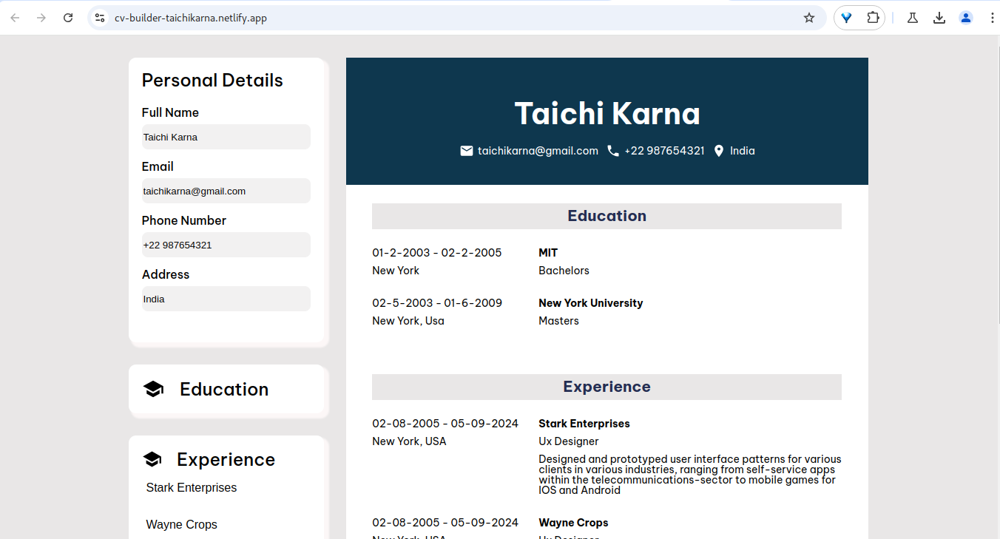

# CV Builder App

A web application built with React.js that allows users to create, customize CV's. The app provides a user-friendly interface for inputting details.

## Features

- **Real-time Preview**: Preview your CV as you build it.

## Tech Stack

- **Frontend**: React.js, HTML, CSS
- **State Management**: React Hooks (useState, useEffect)
- **Styling**: CSS Modules

## Installation

1. Clone the repository:
   ```bash
   git clone https://github.com/TaichKarna/CV-builder.git
   ```

2. Navigate to the project directory:
   ```bash
   cd CV-builder-app
   ```

3. Install the dependencies:
   ```bash
   npm install
   ```

4. Start the development server:
   ```bash
   npm start
   ```

5. Open your browser and visit:
   ```
   http://localhost:5173
   ```

## How to Use

1. **Fill in Personal Details**: Enter your name, contact info, and a short summary.
2. **Add Experience and Education**: Input your past roles, responsibilities, and educational background.
3. **Add Skills & Achievements**: List relevant skills, certifications, and achievements.

## Previews

### Example CV Template 1



## Contributing

Contributions are welcome! Please follow these steps:

1. Fork the repository.
2. Create a new branch (`git checkout -b feature-branch`).
3. Make your changes.
4. Push your branch (`git push origin feature-branch`).
5. Create a pull request.

## License

This project is licensed under the MIT License. See the [LICENSE](LICENSE) file for details.


